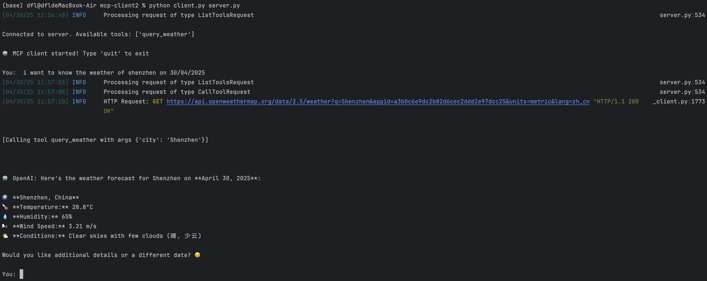

# MCP-Augmented LLM for Reaching Weather Information

## Overview
This system enhances Large Language Models (LLMs) with weather data capabilities using the Message Control Protocol (MCP) framework.

## Demo


### Components
- **MCP Client**: Store LLms
- **MCP Server**: Intermediate agent connecting external tools / resources

## Configuration

### DeepSeek Platform
```env
BASE_URL=https://api.deepseek.com
MODEL=deepseek-chat
OPENAI_API_KEY=<your_api_key_here>
```

### OpenWeather Platform
```env
OPENWEATHER_API_BASE=https://api.openweathermap.org/data/2.5/weather
USER_AGENT=weather-app/1.0
API_KEY=<your_openweather_api_key>
```

## Installation & Execution

1. Initialize project:
```bash
uv init weather_mcp
cd weather_mcp
```
where weather_mcp is the project file name.

2. Install dependencies:
```bash
uv add mcp httpx
```

3. Launch system:
```bash
cd ./utils
python client.py server.py
```

> Note: Replace all `<your_api_key_here>` placeholders with actual API keys
